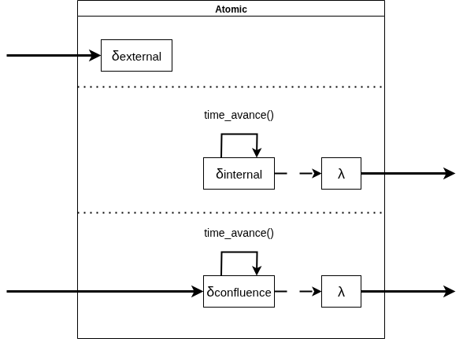

# Multistep DEVS simulator



## Description

Implements a discrete event system specification (DEVS) simulator which runs until all the outputs are processed.


## Usage

```
cd code
python3 -m venv venv
source venv/bin/activate
python3 -m pip install -r requirements.txt
```

Then you can use `src/devs` as a library.

### Class diagram


## Examples

Some example usages

### Factories


```
cd code
python3 src/examples/factories/main.py
```

### Company


```
cd code
python3 src/examples/factories/main.py
```

## OpenCode setup

### Build

docker build -t multistep-devs:24.04 .

### Run

docker run -it \
       --workdir /root/ws \
       -v ~/.local/share/opencode:/root/.local/share/opencode:rw \
       -v $PWD/.mulch/:/root/ws/.mulch:rw \
       -v $PWD/.claude/:/root/ws/.claude:rw \
       -v $PWD/.opencode/:/root/.config/opencode:rw \
       -v $PWD/code/:/root/ws/code/:rw \
       -v $PWD/design/:/root/ws/design/:ro \
       -v "$PWD/spec files/:/root/ws/spec files/:ro" \
       -v $PWD/LAYOUT.md:/root/ws/LAYOUT.md:ro \
       multistep-devs:24.04 bash

## License

```
MIT License

Copyright (c) 2025-2026 EmmanuelMess

Permission is hereby granted, free of charge, to any person obtaining a copy
of this software and associated documentation files (the "Software"), to deal
in the Software without restriction, including without limitation the rights
to use, copy, modify, merge, publish, distribute, sublicense, and/or sell
copies of the Software, and to permit persons to whom the Software is
furnished to do so, subject to the following conditions:

The above copyright notice and this permission notice shall be included in all
copies or substantial portions of the Software.

THE SOFTWARE IS PROVIDED "AS IS", WITHOUT WARRANTY OF ANY KIND, EXPRESS OR
IMPLIED, INCLUDING BUT NOT LIMITED TO THE WARRANTIES OF MERCHANTABILITY,
FITNESS FOR A PARTICULAR PURPOSE AND NONINFRINGEMENT. IN NO EVENT SHALL THE
AUTHORS OR COPYRIGHT HOLDERS BE LIABLE FOR ANY CLAIM, DAMAGES OR OTHER
LIABILITY, WHETHER IN AN ACTION OF CONTRACT, TORT OR OTHERWISE, ARISING FROM,
OUT OF OR IN CONNECTION WITH THE SOFTWARE OR THE USE OR OTHER DEALINGS IN THE
SOFTWARE.
```
